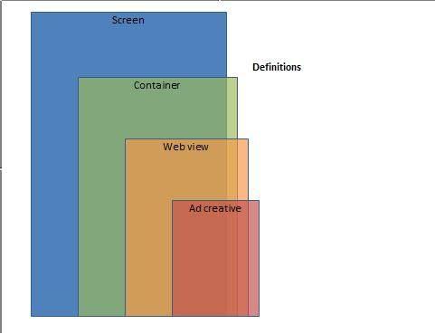
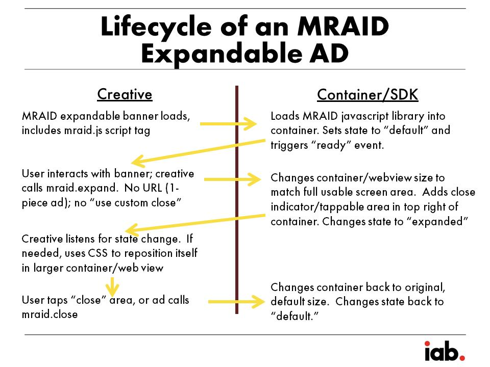
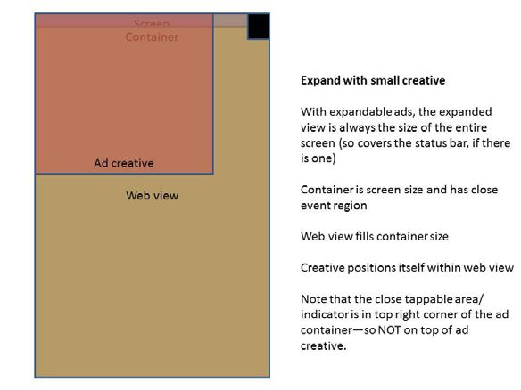

互动广告局（简称IAB）

移动富媒体广告接口规范（MRAID）2.0版本

发布于2012年9月27日

最后修订时间2013年4月16日

#	贡献者
IAB MRAID的工作小组包括来自以下公司的代表：
<pre>
24/7 Real Media, Inc. 					Medialets
AccuWeather.com 						MediaMind
AdMarvel								Microsoft Advertising
AdMeld									Mixpo
ADTECH									Mocean Mobile
Adobe Systems Inc. 						NBC Universal Digital Media
AOL										New York Times Co.
CBS Interactive							Nexage
Celtra									Pandora
Crisp Media								PointRoll
Dow Jones & Company						Rhythm NewMedia
ESPN									Spongecell
FreeWheel								Sprout
Goldspot Media							TargetSpot
Google									Time Inc.
Greystripe								Turner Broadcasting System, Inc.
IDG										Univision
inMobi									The Weather Channel
Innovid									Yahoo!, Inc.
Jumptap
</pre>

#	感谢
IAB感谢ORMMA.org API项目贡献者，给本文档提供了一个起点。ORMMA.org是一批行业思想领袖自2010年春季以来一起开发和测试的一组完整灵活的移动富媒体广告API。在IAB推出MRAID项目以前，ORMMA的贡献者包括：
<pre>
Adam Schuetz, AdMarvel					Philippe Laporte, Goldspot Media
Dennis Doughty, Jumptap					Robert Hedin, The Weather Channel
Jon Badenell, The Weather Channel		Todd Pasternack, Pointroll
Nathan Carver, Crisp Media				Wook Chung, Google
Neal Karasic, Jumptap					Xavier Facon, Crisp Media
</pre>

#	关于MRAID
互动广告局（IAB）的成员和其它重要贡献者联合创建这份文档，对于移动富媒体广告来说，它是一份标准的接口规范。MRAID的目标是解决移动应用、不同广告服务器和不同富媒体平台之间已知的互操作性问题。

##	IAB联系方式

IAB移动营销中心高级总监：Joe Laszlo，mobile@iab.net

#	内容提要
在过去的几年中，由于在移动应用上的富媒体展示广告已经变得越来越流行，各种创新型企业都公认：为移动广告服务创建一个投放生态系统将成为一项巨大的挑战。对于内容出版商和广告主来说，创新型的移动富媒体广告投放会导致许多令人兴奋的可能性，但是同时这也导致了效率低下，经常延缓和阻碍最佳的商业化内容。

简化移动应用广告创意设计者的流程会大大增加代理商将移动纳入其媒体购买清单的意愿。不管是哪个移动设备平台，应用程序或技术用于显示媒体，广告主想要看到让人惊叹的创意，批准它并且决定购买指定的移动媒体库存。

# 	规范
下列术语用于整个MRAID规范。

**广告容器：**广告容器是一个显示广告创意的区域。它是一个提供屏幕区域的容器，我们称之为MRAID容器。它基于web视图，用于广告显示。SDK通常都会提供广告容器，但不是必须。应用程序可能包含来自一个SDK的多个广告容器。

**关闭事件区：**在广告创意中有一块可以轻触的区域叫做关闭事件区，它会引发广告回到默认状态（在缩放式广告中）或者从屏幕中整个移除（在插播式广告中）。

**关闭指引：**给用户一个视觉提醒，指示他们关闭事件区所在的位置。

**控制器：**控制器是一段提供给广告设计者访问MRAID方法和事件的JavaScript代码。广告创意使用控制器执行和广告容器之间的交互，也可以间接的和App及设备交互。

**设备独立像素（DIP）：**通过MRAID API在控制器和创意之间传递的所有长度值都是设备独立像素。

DIP是从物理屏幕像素中抽象出来的，旨在简化App和内容开发跨不同屏幕分辨率的设备。

使用DIP意味着，例如：视网膜显示屏的iPhone和旧款iPhone将返回相同的尺寸，尽管它们之间有着不同的物理像素值。1 DIP大约相当于160分之一英寸（在大约160 DPI设备上的1设备像素）.

在iOS中，这些对应到“点”；Android中，对应到“设备独立像素”。

注意：只有视口比例为1.0时1 DIP才等于1 CSS像素。为了对应CSS像素和DIP，创意应使用如下公式：

`css像素 * 视口比例 = DIP`

**内嵌式广告：**伴随着其它内容一起出现在屏幕上的一种广告，例如网页上或者App内的一个banner。

**插播式广告：**一种显示在内容上方的全屏广告——也被叫做“障碍物”或者“覆盖物”。这类广告必须驳回用户返回到内容的请求（译者注：也就是不允许用户自行关闭广告）。一些插播式广告可以出现在游戏关卡之间，或者一段视频剪辑的前后，再或者其他动态内容中。（在许多杂志类App中，滑动页面之间的广告在MRAID规范下被认为是内嵌式广告。）

**物理像素：**设备屏幕的实际像素。例如，视网膜显示屏的iPhone的物理像素为960x640。MRAID API长度值总是使用DIP（上文定义的）来计算，而不是使用物理像素。

**SDK：**软件开发工具包。集成在出版商App中启用广告容器的可重复使用代码（或类库）。SDK，正如其名，它不是一个可视化组件。

**Web View：**基于HTML显示广告创意的视图。Web View用来执行渲染使用HTML和JavaScript编写的广告。



#	支持MRAID的基本须知
本章详细介绍了App中提供广告服务的SDK（MRAID兼容）的要求。

预计实现将分为两部分。第一部分为富媒体广告在App中的显示定义一个本地容器，第二部分为广告创建者定义一个JavaScript控制器交互用。本地容器封装一个支持HTML和JavaScript的Web View，比如iOS中的UIWebView，控制器充当一个桥梁可以将本地功能集成到基于HTML的广告中。具体实现或许有所不同。

在规划时，关键的设计考虑因素：

* 在应用程序发布者和广告卖家允许的情况下，以一致的方式访问设备的本机功能（方向、位置、加速度等。）
* 行业标准的广告开发（HTML和JavaScript）
* 渐进式的复杂度（简单的事情很简单，复杂的事情是可能的，但更难）

##	技术受众
规范文档本质上是技术性的，但这并不妨碍我们创新。这份文档适用于出版商或SDK供应商，并解决广告设计者的需求。
>###	本地App开发者
在这份规范中对于本地App开发者没有任何要求。为了集成广告到他们的App中，本地App开发者应遵循SDK开发者提供的说明。
>###	SDK开发者
SDK搭建者有责任考虑这些提案以外的问题。（参考“超出范围”）如上所述，预计SDK开发者将提供两个接口用于实现这些提案：SDK提供一个用于本地App开发者集成用的容器和一个给广告设计者直接使用的控制器。
>本文档概述了广告设计者所需的控制器要求。作者意图是：对于现有的SDK，本文的概念可以通过一个外部层来管理。
>###	广告设计者
这份文档对于广告设计者来说，除了使用标准的web，没有创意相关的要求。使用本规范中方法的广告设计者，能够提供给消费者跨平台和出版商的丰富的媒体体验。

对于广告设计者来说，意识到调用本机设备的设计必须是异步的，这一点很重要。对于大多数web开发者，这种情况类似于AJAX编程。

##	视觉窗口和默认的容器设置
创意设计者应注意需要了解他们正在运行的程序可能会覆盖默认的web视图设置。他们应通过查询MRAID控制器来了解，就像他们为了解环境而查询一个网页。这些设置包括容器的高、宽、比例以及用户是否可以改变容器比例。

虽然MRAID并不在Web视图之上建立任何新参数或控制器，我们也建议创意应当检查和调整参数，因为笔者认为创意或许想有一个不同于默认的容器设置。

##	超出范围
每个MRAID实现提供给开发者唯一的功能集。这份文档为交互操作概述了一个最小的功能集，它并不定义那些可能是SDK中的一部分的功能，例如：

* 从广告服务器，广告网络或本地资源检索广告
* 报告
* IDE集成
* 安全/隐私
* 国际化
* 错误报告
* 日志
* 结算和付款
* 广告尺寸和广告行为（MRAID不定义广告尺寸或者用户和广告互动过程中，广告如何移动和改变）
* 为缓存或者离线使用下载资源到本地文件系统

显而易见，SDK开发者必须为广告单元实现在指定区域渲染Web内容的能力。对于大部分环境来说，这个功能作为一个Web View组件已经可用，虽然开发者可能必须开发额外的功能以支持这些规范。

作者的意图是：供应商（SDK提供者）不限于只开发API中概括的功能。他们应当不断创新、不断推出区别于市场上已有功能的新特性。这些其它特性必须在MRAID命名空间之外实现。

从跨MRAID兼容的SDK意义上来讲，一个除了MRAID特性只使用SDK特定功能的广告，已没有必要成为一个MRAID广告。

##	标准Web技术
对于交互操作，只有web兼容的语言应被用于标记和脚本语言。本文假定使用HTML/JavaScript/CSS。广告设计者应当能够在浏览器上开发和测试广告单元。如果广告设计者使用的标记、样式、方法只兼容一种浏览器（例如WebKit CSS3），那么这个广告应针对性的用于兼容的设备。

当可以统一提供新的web标准时，我们鼓励广告设计者们使用它们。这可能包括像短信和电话这样的草案，以及一些广泛实施，但尚未完成的HTML5规范。设计师需要知道，在这种情况下，预期的协议和实现，可能不是真的跨所有设备和平台交互。

##	广告服务器需知
用于传输富媒体广告的服务器应当支持使用JavaScript的HTML广告。

##	广告渲染需知
###	显示HTML广告——广告容器
MRAID兼容的广告容器必须能显示任何HTML广告。容器应调用HTML与JavaScript渲染引擎渲染广告。在本文中，渲染引擎将被称作“Web View”。Web View需要尽可能的体现设备的浏览器特性。比如，iOS开发者或许会使用UIWebView。一个给定的App视图可以有一个或多个广告视图容器，它们都将相互独立的运行而互不干涉。

##	广告设计者需知
###	控制富媒体广告显示——广告控制器
希望使用MRAID的广告设计者，在广告加载时，必须尽早的通过调用mrad.js脚本标识出来。调用mraid.js会通知SDK向素材中注入MRAID javascript代码。

MRAID保持在后台运行，把控制广告显示的权利留给广告设计者，但是当（或者如果）广告需要访问MRAID特性和功能时，MRAID又是可用的以便创意使用MRAID API。不管是广告设计者还是App开发者，创意和富媒体SDK之间的内部交互对他们都是不可见的。

一个不利用任何设备特性的广告根本不需要使用MRAID API。然而，如果广告不调用MRAID，它将得到SDK的默认解决方案。广告因为一些原因使用MRAID API的情况：

* 打开一个嵌入式的Web浏览器
* 检测广告是否可见
* 展开一个广告，比如从banner变成更大尺寸
* 点击广告内触发一个动作

我们鼓励广告设计者依靠MRAID来实现上述效果。

##	生存周期实例
###	简单型广告生存周期实例
非富媒体广告（例如基本的banner）可以选择性地调用MRAID。如果广告没有通过mraid.js脚本标签调用MARID，那么应用程序或者SDK通常会处理此类广告以使它们正常展示。

如果广告设计者更想使用MRAID标准容器，而不是SDK默认容器，那么他们可能希望为这种简单的HTML广告调用mraid.js。在这种情况下，广告设计者必须确保对于任何链接都使用`mraid.open()`打开，以保证统一的行为。

###	MRAID展开式广告生存周期实例
在富媒体广告生存周期实例中，广告设计者使用JavaScript API和本地层通信，和设备及操作系统的功能交互。

举个例子，当用户点击广告时，广告使用MRAID API请求当前广告可以展开。SDK（虽然它不是MRAID规范的一部分）应通知APP广告即将展开，以便于App停止任何事情，用户此时将不能和App交互。SDK随后调整Web View，占据设备的整个屏幕或者广告完全展开后的大小。展开的广告容器会在右上角保留一片空白，作为MRAID强制性关闭事件区，如果广告指定，允许提供创意内的关闭指引，否则应用默认关闭指引。

当用户完成展开式广告后，他们点击关闭按钮使广告回到它们原始大小，显示广告的banner状态，同时通知App它可以继续运行。

###	MRAID插播式广告生存周期
插播式广告生存周期和展开式广告生存周期非常类似。无论广告容器在屏幕是否可见，广告都可以使用MRAID API查询它，在采取其它行动之前一直等到广告容器在屏幕上可见。和展开式广告一样，展开的广告容器会在右上角保留一片空白，作为MRAID强制性关闭事件区，如果广告指定，允许提供创意内的关闭指引，否则应用默认关闭指引。当用户完成插播式广告后，他们可以点击关闭按钮，在这种情况下广告的状态将变为hidden，注销所有事件监听，同时通知App继续运行。

##	MRAID版本
采用MRAID标准在整个广告社区是一项高优先级的事务，并且对于移动富媒体广告跨平台的成功有着至关重要的作用。出于这个原因，IAB发布具有完整功能集的MRAID版本。这将以统一的方式呈现给SDK供应商们符合标准的MRAID API，防止仅实现一部分标准可能出现的碎片继承。

维护完全向后兼容是MRAID项目的一个关键目标。一个MRAID2.0兼容的SDK应能够毫无问题的运行一个MRAID1.0广告，一个MRAID1.0兼容的SDK应能够处理一个MRAID2.0广告中MRAID1.0兼容的特性。

在已经确定的两个MRAID版本中，IAB和其MRAID工作组集中在六个关键目标：

* __高互用性__ —— 开发运行在一个MRAID容器中的广告可以运行在多个平台和操作系统的MRAID容器中。
* __优雅降级__ —— 利用MRAID特性开发的广告也有能力根据需要优雅降级。将来，当获取设备功能访问权变成MRAID标准的一部分时，这一点尤其重要。
* __渐进的复杂性__ —— 广告设计使用的API应该是简单的，只在必要时增加复杂性。
* __广告改变大小和（或者）打开新页面都以统一的方式，最好都在嵌入式浏览器中进行__ —— 关于广告展开和打开App内嵌浏览器（或者内嵌浏览器不存在时，在本地浏览器中），MRAID规定统一的与富媒体SDK之间通信的方式。
* __消费者一致的退出广告体验__ —— MRAID广告始终有统一的退出控制，用户由此可以记住他们退出广告的体验，返回到他们来时的应用程序或内容中。
* __对出版商来说是灵活的__ —— 虽然MRAID兼容的SDK必须支持所有MRAID特性，但是App发布者或广告卖家可以自由的允许或禁止启用MRAID特性的广告。也就是说，MRAID支持富媒体广告特性，但并不规定所有富媒体广告卖家必须支持所有这些功能。

###	1.0版本
MRAID1.0中的方法和事件，满足了富媒体广告最低级别的要求，主要用于显示一个在固定容器中可改变大小的HTML广告（例如，把一个广告从banner扩展到更大尺寸或全屏）和插播式广告。

###	2.0版本
MRAID2.0继承了MRAID1.0的特性，在展开式广告之上，给广告设计者们更多的控制权，并且提供了一个新的方法`resize()`，它允许在广告创意中出现更微妙更有趣的尺寸变化。

另外，MRAID2.0规定了关于查询设备某个功能的标准方式，提出视频创意的统一处理方法，并且解决了目前HTML5没有很好实现的两个本地特性：向设备日历中添加一个条目和在设备相册中存储图片。

对于可以使用MRAID2.0 API开发的广告示例，请看附录部分。

#	接口需求和定义
这个列表概括了MRAID2.0下广告设计者可以访问的所有方法和事件。MRAID2.0（即不在MRAID1.0中）中新增的方法和事件通过星号标识。

**方法**
<pre>
	addEventListener					getVersion
	createCalendarEvent*				isViewable
	close 								open
	expand 								playVideo*
	getCurrentPosition*					removeEventListener
	getDefaultPosition*					resize*
	getExpandProperties					setExpandProperties
	getMaxSize*							setResizeProperties*
	getPlacementType					storePicture*
	getResizeProperties*				supports*
	getScreenSize*						useCustomClose
	getState							getOrientationProperties*
	setOrientationProperties*
</pre>

**事件**
<pre>
	error 								stateChange
	ready 								viewableChange
	sizeChange*
</pre>

##	标识
广告必须标识它们自己是MRAID兼容的。完成这项工作通过尽早的加入MRAID脚本引用，而且最好在MRAID函数被创意引用之前。换言之，MRAID标识脚本必须被MRAID兼容的容器或SDK最先识别出来。

**MRAID**脚本引用

MRAID标签遵循HTML JavaScript语法，以便完整的网页结构和HTML片段都可以被标识为MRAID广告。mraid.js作为一个脚本被引入到文档中，或者使用HTML标签，或者使用JavaScript代码。MRAID示例广告（见[www.iab.net/mraid](http://www.iab.net/mraid)）说明了脚本引用标签应该被放置在什么位置。

`<script src="mraid.js"></script>`

虽然MRAID广告需要像这样通过mraid.js脚本尽早的标识它们自己，以便容器可以注入MRAID类库，但是广告设计者也应避免为了其它目的在广告创意中使用“mraid.js”字符串，因为这样做可能会导致容器或者SDK错误的注入多个MRAID类库副本。

##	初始化
MRAID管理广告和容器之间的交互，并且标识容器是兼容MRAID规范的。广告设计者必须为MRAID包含JavaScript引用，但是实际的JavaScript类库由容器提供，容器的职责是在脚本引入后确保它们对广告尽早的可用，并且通过触发ready事件来发送准备完成信号。

下面分步骤总结了从广告初始化加载到MRAID容器注入API类库的动作。

1. 通过尽早的调用MRAID脚本标签`<script src="mraid.js"></script>`，标识它们自己为MRAID广告。
2. SDK（或者MRAID兼容）容器

	a. 选择性的检测脚本调用

	b. 始终为MRAID广告提供MRAID JavaScript桥接

	c. 提供一个状态为loading并且具有查询状态能力的受限MRAID对象

3. 如果广告使用createElement，需要等mraid.js完成加载
4. 如果MRAID状态等于loading，那么广告使用`mraid.addEventListener('ready')`监听ready事件
5. SDK（或容器）完成向Web View中初始化MRAID类库
	
	a. 改变MRAID状态为为default，同时StateChange事件被触发

	b. 触发MRAID ready事件

6. 广告的ready事件监听器被触发，广告JavaScript代码此时可以使用MRAID API

**ready**事件

当容器完全加载、初始化完成并且准备好来自广告创意的任何调用时，ready事件触发。

在广告创意被加载之前，MRAID兼容的容器负责准备API方法。这会阻止一种情况：因为API方法不可用导致的广告不能为ready事件注册监听。虽然容器可以立即加载所有MRAID，但在广告加载过程中，容器至少要尽早准备好支持getState和addEventListener，否则将没有办法为广告注册ready事件。在容器可能仍然需要较多的时间初始化设置或者准备额外功能的事件中，只有当容器为任意MRAID请求完全准备好时，ready才应被触发。

在执行任何富媒体操作之前，广告应该总是试图等待ready事件。因为一些时间问题，比如要在广告注册监听之前触发ready事件，广告设计者可以配合getState()方法来使用ready事件。

例子

```
function showMyAd() {
    ...
}
if (mraid.getState() === 'loading') {
    mraid.addEventListener('ready', showMyAd);
} else {
    showMyAd();
}
```

“ready”
<pre>
参数：
· none
侧面影响：
· 使MRAID JavaScript类库对广告单元可用
返回值：
· none
触发事件：
· none
</pre>

**getVersion**方法

getVersion方法允许广告在显示前确认基础功能集。版本号必须符合MRAID规范（例如1.0或者2.0），不是供应商的SDK版本号。

getVersion() -> String
<pre>
参数：
· none
返回值
· String – MRAID兼容的SDK版本号或者IAB针对性认证的SDK版本号。举个例子，对于本文的版本号，getVersion()讲返回“2.0”
</pre>

##	初始显示
当其它资源在后台加载时，广告设计者最好提供一段简单的HTML，比如一个``标签，用于他们广告的初始化显示。在JavaScript使用控制器请求调用额外功能时，这段HTML将显示在容器中。最后，一旦所有的资源准备完成，初始显示用的HTML可能就会完全被富媒体广告替代，这些视创意的需求而定。

##	事件处理
事件处理是MRAID的关键概念。Web层和原生层的通信本质上异步的。通过事件处理，广告设计者能够监听指定的事件，并且可以根据需要响应这些事件。MRAID主张广播式事件，在保证最大一致性的同时，支持最广泛的功能性/灵活性。

控制器开放这些方法。

**addEventListener**方法

使用本方法为指定事件订阅一个指定的处理方法。这样，多个监听器就可以订阅一个指定事件，一个监听器可以处理多个事件。在同一时间，一个广告可能注册不止一个监听器，前提是广告必须允许这样做。MRAID2.0支持的事件：

<table border="1" cellpadding="3">
	<tr>
		<th>事件</th>
		<th>描述</th>
	</tr>
	<tr>
		<td>ready</td>
		<td>报告初始化完成</td>
	</tr>
	<tr>
		<td>error</td>
		<td>报告发生错误</td>
	</tr>
	<tr>
		<td>stateChange</td>
		<td>报告状态变化</td>
	</tr>
	<tr>
		<td>viewableChange</td>
		<td>报告显示状态变化</td>
	</tr>
	<tr>
		<td>sizeChange</td>
		<td>报告广告的尺寸信息变化</td>
	</tr>
</table>

addEventListener(event, listener)
<pre>
参数：
· event – String  要监听的事件名称
· listener – 执行监听的函数
返回值：
· none
侧面影响
· none
</pre>

**removeEventListener**方法

使用本方法从指定事件退订处理方法。当事件监听器不再有用时，它们应当被移除以避免出错。如果没有指定监听器方法，那么正在监听事件的所有方法将被移除。

removeEventListener(event, listener)
<pre>
参数：
· event – Strign 事件名称
· listener – 要被移除的函数
返回值：
· none
触发事件：
· none
</pre>

##	错误处理
当容器中发生错误，包含事件错误诊断信息的“error”事件会被触发。对于不同类型的错误，可以使用任意多个监听器进行监控，并且根据需要进行响应。

**error**事件

每当容器错误发生时，error事件就被触发。该事件包含错误发生时的描述，以及，在适当的时候，包含导致错误的操作名称（没有关联动作时，动作参数为null）。而JavaScript错误依然由广告设计师全权负责。

“error” -> function(message, action)
<pre>
参数：
· message: String 错误描述
· action: String 引发错误的动作
经由什么触发：
· 任何出错
</pre>
广告设计者需要注意：错误可以通过底层SDK/容器以异步或同步的方式来处理。

MRAID规范没有定义错误事件中的“message”部分，并且主要适用于广告发布前的创意调试，错误的“action”部分始终是广告尝试使用并导致错误的方法名称。原则上讲，任何MRAID方法都可能引发错误，因此广告设计者在使用错误监听器时应监听下列所有可能的错误动作：
<pre>
	addEventListener					getVersion
	createCalendarEvent 				isViewable
	close 								open
	expand 								playVideo 
	getCurrentPosition 					removeEventListener
	getDefaultPosition 					resize
	getExpandProperties					setExpandProperties
	getMaxSize 							setResizeProperties 
	getPlacementType					storePicture 
	getResizeProperties 				supports 
	getScreenSize 						useCustomClose
	getState
</pre>
虽然任何MRAID方法都可能导致错误，在实践中，使用resize、添加一张图片到相册或者添加一个事件到日历，是最易产生错误的MRAID方法。广告设计者们在使用这些方法时，应该格外注意添加错误监听器，来检查在执行resize、storePhoto、createCalendarEvent动作时是否发生错误，以便于广告创意有可能采取应对措施。

##	控制广告显示
除了广告初始化显示，广告设计者或许会有各种理由需要控制广告显示。

* 为了减少传输时间，App可能会在后台加载广告视图，这样广告虽然在请求，但对用户却并不可见。
* 广告可能扩展到超出应用程序内容的默认大小。
* 一旦用户交互完成，广告可能返回到默认尺寸。

**getState**方法，**stateChange**事件

每个广告容器（或者Web View）都有下列其中之一的状态：

<table border="1" cellpadding="3">
	<tr>
		<th>状态</th>
		<th>描述</th>
	</tr>
	<tr>
		<td>loading</td>
		<td>容器还没有准备好和MRAID实现交互</td>
	</tr>
	<tr>
		<td>default</td>
		<td>应用程序和SDK设定好广告容器的初始位置和大小</td>
	</tr>
	<tr>
		<td>expanded</td>
		<td>广告容器已展开覆盖到应用程序内容的最顶层</td>
	</tr>
	<tr>
		<td>resized</td>
		<td>广告容器已通过MRAID2.0 resize()方法改变大小</td>
	</tr>
	<tr>
		<td>hidden</td>
		<td>插播式广告转变为关闭后的状态。在被支持的情况下，banner广告转变为关闭后的状态</td>
	</tr>
</table>

getState方法返回广告容器的当前状态，返回广告容器是否处于其默认状态，是否是固定位置，是否处于展开或缩放状态，是否是更大的位置，或者是否是隐藏的。

当状态被广告或者环境以程序方式改变时，会触发stateChange事件。当广告视图在default、expanded、resized、hidden状态之间改变时（这些状态都是在调用expand(), resize(), close()产生的）触发stateChange事件。容器或SDK也可以关闭广告作为用户或系统操作的结果，比如从后台恢复运行。

任何MRAID广告在同一时间只能有一个状态。这个规定意味着，在two-part展开式广告中，所有的Web View都只有一种状态。只要是在屏幕上展开的视图，使用getState()都将返回“expanded”。

调用expand(), resize(), close()对于状态的影响定义如下表：

如何阅读：创意的初始状态在表格最左列；当使用一个MRAID方法时，可以从方法名那列往下查到状态如何变更。举个列子，如果广告的状态是“expanded”并且同时使用了close()方法，那么这个广告的状态变为“default”。

<table border="1" cellpadding="3">
	<tr>
		<th>初始状态</th>
		<th>expand()</th>
		<th>resize()</th>
		<th>close()</th>
	</tr>
	<tr>
		<td>loading</td>
		<td>无影响</td>
		<td>无影响</td>
		<td>无影响</td>
	</tr>
	<tr>
		<td>default</td>
		<td>对于banner广告，状态变为“expanded”，插播式广告则无影响</td>
		<td>对于banner广告，状态变为“resized”，插播式广告则无影响</td>
		<td>对于banner广告，状态变为“hidden”（如果SDK/容器支持的话），插播式广告状态则变为“hidden”</td>
	</tr>
	<tr>
		<td>expanded</td>
		<td>无影响（仍然保持“expanded”状态）</td>
		<td>引发错误；（仍然保持“expanded”状态）</td>
		<td>状态变为“default”</td>
	</tr>
	<tr>
		<td>resized</td>
		<td>状态变为“expanded”</td>
		<td>状态变为“resized”（也就是说，事件监听器将监听到一个新的stateChange事件，尽管事件触发后状态依旧是“resized”）</td>
		<td>状态变为“default”</td>
	</tr>
	<tr>
		<td>hidden</td>
		<td>无影响</td>
		<td>无影响</td>
		<td>无影响</td>
	</tr>
</table>

在two-piece展开式广告中，一种新类型广告，展开后的Web View从“loading”状态开始直到MRAID可用，紧接着“ready”事件被触发，然后广告的状态变为“expanded”。two-piece广告中的banner（第一片）同样也将它的状态从“default”变为“expanded”。

对于插播式广告，Web View从“loading”到“default”，当广告关闭时，状态变为“hidden”。

getState() -> String
<pre>
参数：
· none
返回值：
· String: "loading"或"default"或"expanded”或“resized”或“hidden” 
相关事件：
· stateChange
</pre>

“stateChange” -> function(state)
<pre>
参数：
· state - String, "loading"或"default"或"expanded”或“resized”或“hidden” 
经由触发：
· expand()方法、resize()方法、close()方法或者App
</pre>

**getPlacementType()**方法

为了提高效率，广告设计师有时会在banner广告和插播式广告放置点全都使用简单的创意。所以创意应能够知道他们的放置类型，并因此引发不同的行为，每个广告容器都有一个放置类型，来确定广告是嵌入在内容中显示（即banner）还是作为插播覆盖到内容上（比如在App内容传输过程中）。容器返回放置类型的值以便于创意在需要时引发不同的行为。容器并不确定banner是否能展开（这个由创意决定），因此不会专门为展开式广告返回一个放置类型。

<table border="1" cellpadding="3">
	<tr>
		<th>值</th>
		<th>描述</th>
	</tr>
	<tr>
		<td>inline</td>
		<td>默认的放置类型是嵌入到内容中显示（即banner）</td>
	</tr>
	<tr>
		<td>interstitial</td>
		<td>这种广告放置类型是覆盖在内容上面</td>
	</tr>
</table>

getPlacementType应该总是返回广告最初显示时设定的值。也就是说，在two-part展开式广告中，如果调用getPlacementType，第二部分（展开的部分）应当同样返回“inline”。

getPlacementType() -> String
<pre>
参数：
· none
返回值：
· String: "inline", "interstitial" 
相关事件：
· none
</pre>

**isViewable**方法，**viewableChange**事件

除了广告容器的状态，有一种情况是广告容器可能作为App缓存区的一部分已经在屏幕之外加载以帮助提供流畅的用户体验。在插播式广告中或者采用滚动视图的App中，这种方式格外流行，比如在游戏关卡之间。

isViewable方法返回广告容器当前是否在屏幕上。当广告从屏幕上离开时会触发viewableChange事件，反之亦然。对于two-piece展开式广告，当广告状态为expanded时，isViewable将基于可见的expanded piece返回一个值。

广告在任何情况下都有可能在屏幕之外加载，最佳实践是：广告检查自身可见状态或者在采取任何行动之前注册viewableChange监听事件。

注意：MRAID并不定义在屏幕上构成广告可见性的最小像素或百分比阀值。（IAB内部目前有一个进行中的项目，为App中的广告尺寸建立指导方针，可能会引入可见性阀值）

isViewable() -> boolean
<pre>
参数：
· none
返回值：
· boolean - 
true：容器在屏幕上并且对用户可见；
false：容器不在屏幕上并且不可见
相关事件：
· viewableChange
</pre>

“viewableChange” -> function(boolean)
<pre>
参数：
· boolean - 
true：容器在屏幕上并且对用户可见；
false：容器不在屏幕上并且不可见
经由触发：
· 应用程序视图控制器的改变
</pre>

下面是一个在行动之前同时考虑到“ready”和“isViewable”的广告示例。

```
// Wait for the SDK to become ready
if (mraid.getState() === 'loading') {
	mraid.addEventListener('ready', onSdkReady);
} else {
	onSdkReady();
}

function onSdkReady() {
	// Wait for the ad to become viewable for the first time
	if (mraid.isViewable()) {
		showMyAd();
	} else {
		mraid.addEventListener('viewableChange',function(viewable) {
			if (viewable) {
				mraid.removeEventListener('viewableChange', arguments.callee);
				showMyAd();
			}
		}); 
	}
}

function showMyAd() {
... 
}
```

##	改变广告尺寸

MRAID2.0包含三种截然不同的方式，用于广告改变尺寸。目前最简单的方式就是使用open()方法，它适用于那些需要在新浏览器窗口（通常是App内嵌浏览器，但是也有可能是设备原生浏览器）加载、为了点击率的网站。

expand()方法适用于那些用简单直接的方式覆盖到应用内容上的广告。

除了这些，resize()方法适用于那些需要精细缩小或放大的广告，与其所运行的App进行对话。这个方法允许广告设计者完全自由的控制和权衡：创意和App/容器同时需要额外的方法和监听器，以在不同的放置点有恰当的响应。

###	rezie(), expand(), open()之间的区别

虽然这些方法都是相关联的，但他们提倡渐进的复杂性。也就是说，简单的操作应当是简单的，但是复杂的结果仍然可行。理解rezie(), expand(), open()之间的区别有助于广告设计者根据需要选择更好的方法。

open()

* 最低通用标准
* 用于广告主的着陆页或迷你站
* 打开一个新的URL，通常是App内嵌浏览器，然而也有可能是设备原生浏览器
* 总是全屏
* 没有附加属性

expand()

* 简单的接口
* 生硬的广告体验
* 全屏
* 少量的附加属性
* 支持one-part或two-part创意
* 在固定位置（右上角）有MRAID强制性关闭事件区
* 对于创意相对定位

rezie()

* 灵活的接口
* 连续，非模态的广告体验
* 没有默认值，尺寸可变大变小
* 必须的附加属性
* 有MRAID强制性广告关闭区，但是广告设计者可以在创意内改变这个区域的位置
* 可能是绝对定位
* 支持调整大小时指定方向


这个表格总结了这些方法之间的区别。

<table border="1" cellpadding="3">
	<tr>
		<th>属性</th>
		<th>open()</th>
		<th>expand()</th>
		<th>resize()</th>
	</tr>
	<tr>
		<td>模态的</td>
		<td>Y</td>
		<td>Y</td>
		<td>N</td>
	</tr>
	<tr>
		<td>强制关闭控制</td>
		<td>N</td>
		<td>Y</td>
		<td>Y</td>
	</tr>
	<tr>
		<td>浏览者停留在广告里</td>
		<td>N</td>
		<td>Y</td>
		<td>Y</td>
	</tr>
	<tr>
		<td>two-part创意</td>
		<td>n/a</td>
		<td>Y</td>
		<td>N</td>
	</tr>
	<tr>
		<td>one-part创意</td>
		<td>n/a</td>
		<td>Y</td>
		<td>Y</td>
	</tr>
	<tr>
		<td>与屏幕对齐</td>
		<td>n/a</td>
		<td>Y</td>
		<td>N</td>
	</tr>
	<tr>
		<td>给一些小创意提供背景</td>
		<td>n/a</td>
		<td>Y</td>
		<td>N</td>
	</tr>
	<tr>
		<td>向上增大尺寸</td>
		<td>n/a</td>
		<td>Y</td>
		<td>Y</td>
	</tr>
	<tr>
		<td>向下减小尺寸</td>
		<td>n/a</td>
		<td>N</td>
		<td>Y</td>
	</tr>
	<tr>
		<td>应用程序的最大区域</td>
		<td>n/a</td>
		<td>N</td>
		<td>Y</td>
	</tr>
	<tr>
		<td>完成必须回调</td>
		<td>n/a</td>
		<td>N</td>
		<td>Y</td>
	</tr>
	<tr>
		<td>支持方向</td>
		<td>n/a</td>
		<td>N</td>
		<td>Y</td>
	</tr>
	<tr>
		<td>创意能控制尺寸改变后的广告</td>
		<td>n/a</td>
		<td>N</td>
		<td>Y</td>
	</tr>
	<tr>
		<td>App能返回默认状态</td>
		<td>n/a</td>
		<td>N</td>
		<td>Y</td>
	</tr>
</table>

在MRAID2.0标准中，创建半屏非模态扩展必须使用resize()方法。下列表格反映出expand的“isModal”属性被强烈反对使用。MRAID2.0规范下，非全屏展开式创意中调用expand()必须要求Web View容器是空白的，采用覆盖或者将下层App变模糊来突显广告，也就是说，扩展式广告本质是模态的。从这种意义上来讲，模态半屏式广告在MRAID2.0中是不允许的。

<table border="1" cellpadding="3">
	<tr>
		<th></th>
		<th>模态</th>
		<th>非模态</th>
	</tr>
	<tr>
		<th>全屏</th>
		<td>使用expand()</td>
		<td>不可能</td>
	</tr>
	<tr>
		<th>半屏</th>
		<td>不可能</td>
		<td>使用resize()</td>
	</tr>
</table>

##	Open：在浏览器窗口中打开外部移动站点

如果广告需要打开一个外部移动站点或者迷你站，对于一个标准的MRAID广告，可以调用open方法，它将会打开一个浏览器窗口用于查看外部HTML。只要有可能，open操作将通过一个App内嵌浏览器打开。

**open**方法

调用open方法会显示一个App内嵌浏览器用于载入一个外部URL。在那些不允许内嵌浏览器的设备平台上，open方法使用本地浏览器载入外部URL。

注意：open方法应仅用于那些非MRAID广告的外部网页。外部页面不会载入MRAID兼容的SDK，因此在内嵌浏览器中调用close方法将没有任何效果。它只能通过用户选中浏览器窗口的关闭按钮来关闭，需要特殊实现。

使用这个方法用于打开浏览器来载入外部网页。依赖于实现，有可能会打开一个外部浏览器。为了保持MRAID不跳出的广告体验，使用expand方法替代open。

本地浏览器的控制“回退、前进、刷新、关闭”将一直显示。为了报表，open方法可能会被SDK供应商作为一个报告事件来使用。

open(URL)
<pre>
参数：
· URL - String, 网页URL
返回值：
· None
</pre>

##	超链接

当用户在MRAID广告中点击一个HTML超链接（通过`<a href="">`标签定义），会有两种可能：目标页面可以在现有的Web View中载入，或者目标页内容可以打开一个独立的浏览器窗口并在那里载入这个链接。兼容MRAID的SDK可以选择两种方式的任何一种，因此广告设计者们应避免使用内嵌超链接和`window.location`。对于一个标准MRAID广告，指定链接要在单独的浏览器中打开页面时，`mraid.open()`才是恰当的方法。在广告视图中加载新网页后可以离开广告并没有被写入MRAID规范中，App此时也许处在不可用状态。

##	处理Call-to-Action事件

富媒体广告超过迷你站，实现多种call-to-action事件接口。这些事件可能作为一个锚点或脚本函数执行。它意味着容器或SDK不能仅仅监听浏览器接口。必须还要支持可编程的接口/点击（例如`window.location`改变）

##	Expand：简单的，模态的，增加广告的尺寸

对于那些需要用相对简单的方式改变大小的广告创意，通常是从横幅扩大至全屏大小，expand方法提供了一种简单的方式来传达给容器。

**expand**方法

expand方法将引发已存在的Web View（对于one-part创意）或者新的Web View（对于two-part创意），以最高层级（例如，在一个比任何App内容都要高的z-index值）打开。展开后的视图要么包含一个全新的HTML文档（如果指定URL），要么继续使用原先默认位置的文档。当广告处于展开状态时，默认位置通常会被隐藏或者让浏览者难以访问，因此当展开状态可用时，默认位置不应该有任何动作。因而，一个完整的创意实现允许广告设计者使用one-part广告（banner和面板是同一个创意的一部分）和two-part广告（banner和面板分别是独立的HTML创意）

expand方法可以改变广告容器大小，同时将状态从default或resized更改为expanded，然后触发stateChange事件。在one-piece广告和two-piece广告案例中，多次调用expand()将被忽略，也不会影响其状态（仍然保持expanded状态）

一个展开后的视图必须覆盖屏幕所有可用区域，尽管广告创意或许不需要（比如，通过透明或非透明遮罩）。展开后的广告总是模态的，在此期间，容器自然的应阻止新的来自loading的广告，以便于用户可以不中断的完成与广告创意之间的任何交互。其它个别应用程序的难点，比如使用多个窗口对象构建App，或者定时改变内容的z-order，当实现expand方法时，SDK供应商必须考虑这些问题。

展开后的视图必须允许终端用户可以关闭当前创意。这一点在下文关闭可扩展型广告和插播式广告的描述中被进一步论述。

在屏幕的什么位置上放置展开后的广告，尤其当展开后的视图可以被放置在多个位置时，这些由广告设计者决定。对于全屏扩展广告，所有MRAID兼容的SDK将给予完整的设备屏幕空间，同时定位广告以便于它完全可见。

当广告的尺寸比设备屏幕的尺寸更大或更小时，SDK将调整Web View的尺寸同设备和App所允许的最大尺寸一致。创意不会按比例的缩小或增大到设备屏幕的大小；而是在展开的Web View之内，通过css position来增大广告创意。



当不传入URL参数调用expand方法时，当前视图将被重用，简化报告和广告制作。原有的素材不用重新加载，也不需要记录额外的展示次数。one-part创意允许这种定义。

当传入URL参数调用expand方法时，将使用一个新的视图。two-part创意允许这种定义。应用two-part扩展型广告时，第二部分（通过URL指向的）必须是一个完整的HTML页面（不是HTML片段/碎片），同时必须单独的从SDK/容器请求mraid.js（假设它需要MRAID）。不管广告展开后的部分是否请求mraid.js，控制器总是会提供关闭控制（可选的，取决于如何设置expandProperties）和关闭指引。

expand([URL])
<pre>
参数：
· URL (可选): 本文中的URL会在一个新的遮罩视图中显示。如果传入null或者不使用此参数，当前广告的主体会在同一个Web View中使用
返回值：
· none
触发事件：
stateChange
</pre>

##	控制expand属性
expand属性是为了给广告设计者提供额外的功能。广告设计者可以通过设置expand属性来限制广告素材的宽和高，不管创意是否提供了自定义的关闭指引。expandProperties保存在一个可读写的JavaScript对象中。广告设计者也可以通过方向属性单独的控制展开式广告的方向。

expand属性只能在expand()方法调用之前设置。当广告处于expanded状态时，设置expand属性将没有效果。

```
expandProperties object = { 
“width” : integer,
“height” : integer,
“useCustomClose” : boolean,
“isModal” : boolean (read only)
}
```

属性：

* width：integer —— 创意的宽度，默认为全屏后的宽。
* height：integer —— 创意的高度，默认为全屏后的高。注意在设置前得到的宽高属性值实际上就是屏幕的宽高值。这允许那些想使用App或设备尺寸信息的广告设计者，在有必要时进行调整。
* useCustomClose: boolean —— 为true时，广告容器不再显示默认的关闭图标，依赖广告创意自定义关闭指引；为false时（默认），显示默认关闭图标。此属性有一个完全相同功能的useCustomClose方法（下文描述），方便广告创建者使用。
* isModal: boolean —— 为true时，广告容器是模态的；为false时，广告容器是非模态的。这是一个只读属性。注意在MRAID1.0中，它的值可以是false，但在MRAID2.0中永远返回true。

**getExpandProperties** 方法

getExpandProperties方法返回完整的含有expand属性的JavaScript对象。

使用此方法来获取属性扩展广告。

getExpandProperties() -> JavaScript Object
<pre>
参数：
· none
返回值：
· { ... } - this object contains the expand properties
触发事件:
· none
</pre>

**setExpandProperties** 方法

setExpandProperties设置整个含有expand属性的JavaScript对象。

setExpandProperties(properties)

使用这个方法设置广告的展开属性，包括广告创意的最大宽度和高度。

<pre>
参数：
· properties: JavaScript Object { ... } —— 这个对象包含广告的宽高值，更多属性参考properties对象.
返回值：
· none
触发事件：
· none
</pre>

##	控制方向属性
对于展开式广告和插播式广告，orientation属性对象为广告设计者提供了更多的控制权。orientationProperties保存在一个可读写的JavaScript对象中。orientationProperties只影响处于expanded状态的展开式广告或插播式广告。一个处于default状态的banner不能使用orientationProperties来阻止App重新定向，或者强迫App切换到一个不同的方向布局。缩放式广告可以使用orientation属性，但是它们将不会产生任何作用。

```
orientationProperties object = { 
"allowOrientationChange" : boolean,
"forceOrientation" : "portrait|landscape|none"
}
```

* allowOrientationChange: boolean —— 如果设置为true，广告容器将允许基于设备取向的变化；如果设置为false，则忽略这种变化（例如：即使设备改变方向，Web View也不会改变）。默认值是true。不管allowOrientationChange如何设定，广告创意通过设置forceOrientation的值总是可以改变它们的方向。
* forceOrientation: string —— 可以设置portrait、landscape、none其中一个值。如果设置了forceOrientation的值，不管设备的方向如何，视图都必须以特定方向打开。也就是说，如果用户在横屏模式下观看广告，并且点击展开它，如果广告设计者把forceOrientation的属性设置为portrait，那么广告将以竖屏模式打开。默认值为none。

为了能更精细的控制广告行为，在广告处于expanded之后，无论方向属性是什么，广告设计者都可以改变它的值。这种广告或许在横屏模式启动，但指引用户改变方向来玩一个游戏。游戏需求倾向于，除非用户完成它，否则不允许用户改变方向。MRAID兼容的SDK必须能够接受各处用户交互的方向属性改变

举个例子：

```
mraid.setOrientationProperties ( {"allowOrientationChange":true} );
mraid.expand()
/* user changes to landscape, starts game */
mraid.setOrientationProperties ( {"allowOrientationChange": false } );
/* user is done with game */
mraid.setOrientationProperties ( {"allowOrientationChange":true} );
```

**getOrientationProperties** 方法

getOrientationProperties方法返回完整的含有orientation属性的JavaScript对象。

使用这个方法为展开式广告的展开部分或者插播式广告获取方向属性。

getOrientationProperties() -> JavaScript Object
<pre>
参数：
· none
返回值：
· { ... } —— 这个对象包含orientation属性。
触发事件：
· none
</pre>

**setOrientationProperties** 方法

setOrientationProperties设置JavaScript方向属性对象。

setOrientationProperties(properties)

使用这个方法设置广告的方向属性。

<pre>
参数：
· properties: JavaScript Object { ... } —— 这个对象包含allowOrientationChange和forceOrientation的值。
返回值：
· none
触发事件：
· none
</pre>

##	关闭展开式广告和插播式广告

MRAID兼容的SDK必须提供给终端用户关闭广告的能力。这个要求保证了即使广告出错，用户也能回到内容中去。广告设计者通过close()方法（下文描述），能够自己决定是否提供额外的设计元素用于关闭广告。MRAID从两个方面来区分关闭功能：

* 关闭事件区：广告创意上的一个可点击区域，能使广告关闭回到它默认状态。对于所有MRAID展开式广告和插播式广告，关闭事件区是必须的，它由容器提供并出现在容器的右上角。
* 关闭指引：给用户一个视觉提醒，指示他们关闭事件区所在的位置。容器会在广告关闭区提供一个默认的关闭指引。创意设计者还可以使用他们自定义的关闭图标，此时他们应禁止默认关闭指引。

MRAID要求在容器右上角预留的关闭事件区是50x50的可触控区域。预留可点击区域为广告设计者运行跨App和富媒体供应商提供了一致性。供应商/App出版商的控制关闭指引一般默认设计到左边。广告设计者可以自行选择是否为默认关闭功能提供指引。如果广告设计者在创意中引入关闭指引，他们必须这样指定：通过useCustomClose()方法，或者在expandProperties()中设置useCustomClose属性。如果广告设计者不提供自定义关闭图标，容器将提供默认关闭指引。容器提供的可触控区域将被放置在一个比其它App或广告内容更高层级的位置，并且对终端用户永远可用。

**对于two-part广告：** 如果调用expand方法时传入URL参数（即two-part广告），那么关闭广告后必须显示原有内容。当广告变为展开状态时如果App暂停，那么应通知App扩展状态发生了改变。

**对于one-part广告：** 如果展开式或插播式广告视图是使用容器提供的关闭事件区关闭的，那么stateChange事件依旧会被触发同时通知App扩展状态发生了改变。展开的广告必须一直监听stateChange事件，并且在必要时进行调整。

**close** 方法

close方法会使广告容器回到初始状态。对于处在expanded或resized状态的广告，调用close方法会将广告状态变为default。对于处在default状态的插播式广告，调用close方法会将广告状态变为hidden。在本规范中，对于处在default状态的横幅广告，调用close产生的影响特意留下没有定义。它依赖于特定实现，可能被忽略，或者产生一个错误，再或者将横幅广告的状态变为hidden。因此，一般不建议广告设计者在横幅广告中调用mraid.close()方法。广告设计者或许可以把它当做MRAID强制关闭要求的一个附加方法来使用。它也会触发stateChage事件。

注意：如果一个广告多次调用resize()或者在expand()之后调用resize()，调用close()方法会将创意返回到它默认状态（横幅）。它不是简单的撤销最近的resize()或expand()调用。

close()
<pre>
参数：
· none
返回值：
· none
触发事件：
· stateChange
</pre>

**useCustomClose** 方法

尽管MRAID要求所有的实现容器必须提供一个含默认关闭图标的可点击区域，但对于广告创建者来说，使用他们自己设计的关闭指引也是可能的。

这个方法作为expand属性中一个同名属性的快捷方法。设置useCustomClose属性或者调用此方法，两者具有相同的效果，可以互换着使用。如果一个广告通过expand属性和此方法都设置了useCustomClose，任何较晚的调用将覆盖较早的设置。他们通知容器停止使用默认的关闭指引。

对于展开式广告，设计者不需要调用此方法，通常在setExpandProperties()方法中设定useCustomClose属性即可。

对于那些无法调用expand方法的独立插播式广告，但是仍然要求具有MRAID强制关闭选项，广告设计者应在ready事件完成后立即调用该方法。

广告设计者应该清楚直到useCustomeClose方法被调用或者属性被设置之前，MRAID兼容的SDK必须显示默认的关闭指引。

useCustomClose(boolean)
<pre>
参数：
· true —— 广告创意提供它们自己设计的关闭指引
· false —— 将会显示容器为关闭指引提供的默认图片
返回值：
· none
触发事件：
· none
</pre>

##	Resize：可完成复杂的广告尺寸变化

广告创意需要进行连续的尺寸变化，或非模态的改变尺寸到小于全屏尺寸，通过调用resize方法能够实现。正如expand那样，resize方法工作在一个z-index值比App内容更高的层级，因而被放置在App内容之上，也不用占用或重新定位App内容。

**resize** 方法

resize方法使用现有的HTML文档来改变Web View的大小。像expand()一样，resize()引起的尺寸改变也发生在视图的最高层级，所以不会自动转移或以其他方式重新定位底层内容。那些想支持内容移动广告（像“推-下”）的App出版商，可以使用resize这样做，但是必须单独的实现响应resize的移动App内容。

调用resize方法会使广告状态从default变为resized，并且触发stateChange事件。创意可以多次调用resize方法。额外的调用也会触发stateChange事件，尽管状态仍然是resized。处于expanded状态时，调用resize会导致错误，并且不会改变状态。

注意：那些展开至全屏（或更大尺寸）的广告创意不应使用resize，这类广告创意应该总是使用expand。调用resize永远会产生非模态的尺寸变化，并且App的一部分对终端用户总是可见。

使用此方法来请求默认广告视图调整它们的大小到所需尺寸和屏幕位置。有一点需要注意的是：resize()依赖存储在resize属性对象中的参数。因此，在试图调用resize()之前，创意必须通过setResizeProperties()方法设置他们的参数。在setResizeProperties属性之前调用resize将产生错误。

容器会通知App广告创意的resize请求，以便于App可以对改变作出适当的反应。举个例子：某个积分出版商监听resize()调用以实现像“推-下”这样的广告。如果resize是有效的，那么sizeChange将被触发。如果参数超出指定范围，那么error事件会捕获这个异常。

resize()
<pre>
参数：
· none
返回值：
· none
触发事件：
· sizeChange, stateChange
侧面影响：
· 改变状态
</pre>

**调整尺寸后的广告关闭控制**

像展开后的广告一样，对于浏览广告的人来说，调整尺寸后的广告必须有办法能使广告回到它默认状态。MRAID从两个方面来区分关闭功能：

* 关闭事件区：广告创意上的一个可点击区域，能使广告关闭回到它默认状态。对于所有MRAID缩放式广告，关闭事件区是必须的，它由容器提供并由创意指定位置。
* 关闭指引：给用户一个视觉提醒，指示他们关闭事件区所在的位置。对于缩放式广告，容器不会在关闭事件区提供关闭指引。相反的，广告创意必须总是提供它们的自定义关闭图标。

因此MRAID兼容的SDK必须始终要在广告创意上提供给容器50x50的关闭事件区域（点击后使广告回到默认状态）。虽然必须要有这个关闭事件区，但是广告设计者可以自行指定它在广告上的位置。如果广告设计者选择不为关闭事件区指定位置，那么容器会把它定位到缩放式广告的右上角。

缩放式广告在调整自身大小时必须保证关闭事件区在屏幕上能出现。如果容器/SDK检测到一个将导致关闭事件区离开屏幕的缩放请求，容器/SDK会返回错误，并忽略resize操作（即：保留广告的当前状态）。这个要求也意味着，为了保证在缩放后的创意上有关闭事件区空间，缩放式广告最低要求50x50像素.

对于resize()，不像expand()那样，容器会提供一个默认关闭指引。它更期待广告设计者在创意中自己引入关闭指引。

虽然点击关闭控制是强制性的，但是通过close()方法，广告设计者可以自由的采用其它方式来关闭广告。

**resizeProperties** 对象

```
resizeProperties object = { 
“width” : integer, 
“height” : integer,
“offsetX” : integer, 
“offsetY” : integer, 
“customClosePosition” : string, 
“allowOffscreen” : boolean
}
```

注释：

* width: integer —— （必须）创意的像素宽
* height: integer —— （必须）创意的像素高
* offsetX: —— （必须）TODO
* offsetY: —— （必须）TODO
* customClosePosition: string —— （可选）"top-right"、"center"、"bottom-left"、"bottom-right"、“top-center”或者“bottom-center”。表示相对于缩放的创意，容器提供的关闭事件区的原点位置。如果没有指定或者不是这些选项之一，默认取"top-right"。
* allowOffscreen: —— （可选）告诉容器是否应该允许缩放创意绘制完整/部分的超出屏幕。
    * **True (default)**: 容器不应试图定位缩放创意。
    * False: 容器应尽量重新调整缩放创意来适应getMaxSize()的取值。

当allowOffscreen设置为false时，SDK会尽可能的移动默认（banner）广告容器以保证缩放的创意适应屏幕。举个例子，如果一个在屏幕最上方的广告，想往上扩展50像素，那么SDK将先把默认（banner）广告向下移动50像素，然后再执行resize。这种情况下如何allowOffscrren设置为true，广告展开后的部分将超出屏幕的顶部。

allowOffscreen并不能解决所有的定位问题。比如，如果一个广告在横屏方向成功的缩放，但随后由于方向改变为纵向，变得比屏幕的尺寸大，此时设置为false的allowOffscreen将没有效果，同样的，容器/SDK也没有办法成功的将横向创意重定向成适合竖向屏幕。

注意width、height、offsetX和offsetY是必须的，他们没有默认属性值。如果广告创意视图在设置这四个属性之前调用resize()，容器会保留广告处于当前状态并返回错误。

**getResizeProperties** 方法

getResizeProperties返回完整的含有resize属性的JS对象。

使用此方法获取广告缩放后的属性。

getResizeProperties() -> JavaScript Object
<pre>
参数：
· none
返回值：
· { ... } - 包含resize属性的JS对象
触发事件：
· none
</pre>

**setResizeProperties** 方法

使用此方法来设置广告的缩放属性，特别是width和height属性。
<pre>
参数：
· properties: JavaScript Object { ... } —— 这个对象包含要缩放广告的宽和高、关闭位置、偏移方向（都以DIP为单位）、广告是否可以缩放到离开屏幕。更多信息见resizeProperties对象。
返回值：
· none
触发事件：
· none
</pre>

QA需要仔细的测试缩放型广告。像下面这样，广告给容器设置一个不可能的参数，会触发error事件并且resize不会执行。比如说，如果某个广告设置allowOffscreen为false，但是设置了比实际适合屏幕尺寸要大的宽和高，那么就会发生错误。

##	检测屏幕和广告的位置及大小

MRAID2.0引入了几个能使广告监测它自身展开到哪儿和展开到多大的方法，还有它可以展开的最大尺寸。广告设计者可以使用这些特性来增强广告的灵活性，以便在不同设备或不同屏幕尺寸的设备上有不同的行为。

**getCurrentPosition** 方法

getCurrentPosition方法返回广告视图当前的位置和尺寸，以DIP为单位。

getCurrentPosition() -> JavaScript Object
<pre>
参数：
· none
返回值：
· JavaScript Object - {x, y, width, height}：
x=从getMaxSize方法定义的矩形左边开始的偏移量（DIP为单位）
y=从getMaxSize方法定义的矩形顶部开始的偏移量（DIP为单位）
width=当前容器的宽。
height=当前容器的高。（都是以DIP为单位）
关联事件：
· none
</pre>

**getMaxSize** 方法

getMaxSize方法返回广告可以展开到或缩放到的最大尺寸（宽和高都以DIP为单位）。如果App在设备上全屏运行（即：覆盖状态栏），最大尺寸即是全屏的大小。如果App以小于全屏尺寸在设备上运行，因为屏幕要为状态栏或其他App外部元素保留区域，所以getMaxSize将返回包含App视图（它定义了广告所能调整大小的最大空间）的尺寸。

getMaxSize() -> JavaScript Object
<pre>
参数：
· none
返回值：
· JavaScript Object, {width, height} —— 视图可以增长到的最大宽和高
关联事件：
· none
</pre>

**sizeChange** 事件

当广告的尺寸在App界面内发生改变时会触发sizeChange事件。它可能是设备方向改变或调用resize或调用expand方法产生的结果。都是以DIP为单位。

当广告的Web View的显示状态发生改变时，触发此事件。

sizeChange -> function(width, height)
<pre>
参数：
· width - Number: 视图的宽。
· height - Number: 视图的高。
经由触发：
· 缩放、展开、关闭、方向改变或者在App注册尺寸相关事件监听器后导致广告视图尺寸发生改变时触发。
</pre>

**getDefaultPosition** 方法

不管视图处于何种状态时调用，getDefaultPosition方法都将返回默认广告视图的位置和尺寸（DIP为单位）。

使用此方法获取默认广告视图的位置和尺寸。

getDefaultPosition() -> JavaScript Object
<pre>
参数：
· none
返回值：
· JavaScript Object - {x, y, width, height}：
x=从getMaxSize左边开始的偏移量（DIP为单位）；
y=从getMaxSize顶部开始的偏移量（DIP为单位）；
width=当前容器的宽；
height=当前容器的高；
</pre>

**getScreenSize** 方法

getScreenSize方法基于当前方向，以DIP为单位，返回正在运行广告设备的实际像素宽和高。有一点需要注意的是：如果设备从横屏转为竖屏，ScreenSize将发生改变（反之亦然）。另外一点需要注意的是：getScreenSize返回设备屏幕的总计尺寸，包含操作系统给状态栏/系统栏的预留区域，或那些可以被App或广告覆盖的其它区域。设计师寻找能够检查创意还有多少屏幕可用区域时，getMaxSize比getScreenSize更好。

getScreenSize() -> JavaScript Object
<pre>
参数：
· none
返回值：
· {width, height}
关联事件：
</pre>

##	离线请求和指标

当设备没有网络连接时，富媒体广告也可以工作，要完成这项任务需要有本地存储和延迟转发功能，衡量用户会在什么时候和广告交互以及如何交互。

MRAID有潜力提供通用的API以促进存储和广告效果转发，以及其它一些从App返回到广告服务器的指标。然而，除非测量方法和指标本身是标准化的（比如正在进行的IAB/MMA/MRCAPP内广告度量指南），在这之前向MRAID中添加测量功能都为时过早。

MRAID工作组希望这些特性能被评估，并且有可能添加到MRAID中，成为以后MRAID发布版的一部分。

##	访问本地功能

在广告设计中，对于图像需求，基础功能，甚至日益递增的被真正富媒体广告所需要的高级广告功能清单， MRAID都鼓励尽可能的使用标准Web技术。围绕着本地特性，MRAID扮演的角色是帮助富媒体广告发现设备有什么本地功能可以支持，并且填补那些没有普及可用的功能，或者HTML5/Webkit中没有完全稳定和统一的特性。

**supports** 方法

supports方法允许广告询问设备支持的指定功能。

一个MRAID兼容的SDK，在任何设备中都必须能够提供以下功能列表中哪一项是可用的。然而，个别出版商实现的SDK可能会导致和出版商政策相冲突的停用功能/特性。

<table border="1" cellpadding="3">
	<tr>
		<th>值</th>
		<th>描述</th>
	</tr>
	<tr>
		<td>sms</td>
		<td>设备支持使用短消息功能：按照协议发送一个短消息</td>
	</tr>
	<tr>
		<td>tel</td>
		<td>设备支持使用电话功能拨打电话：按协议</td>
	</tr>
	<tr>
		<td>calendar</td>
		<td>设备可以创建一个日历项</td>
	</tr>
	<tr>
		<td>storePicture</td>
		<td>设备支持MRAID storePicture方法</td>
	</tr>
	<tr>
		<td>inlineVideo</td>
		<td>设备可以使用&lt;video&gt;标签播放HTML5视屏文件，并且按着video标签中指定的尺寸（宽和高）播放。这里并不需要以全屏方式播放视频。</td>
	</tr>
</table>

supports(feature) -> Boolean

<pre>
参数：
· String  要检测特性的名称（sms, tel, calendar, storePicture, inlineVideo）
return values:
· Boolean 
true —— 支持该功能，并且getter和事件都是可用的。
false —— 当前设备不支持本功能。
</pre>

##	用设备的物理特性工作

大多数设备都有几种不同类型的传感器可以报告该设备的各种物理特性，例如它的位置，指向，取向，和运动轨迹。当前，在HTML5中，访问这些特性中的大部分功能已成为标准（或者在不远的将来），在这种情况下，开放的标准提供访问设备的功能或特性，MRAID标准推迟到开放标准之后。

**设备方向**

广告创意应能通过HTML5请求设备或容器的方向，和MRAID实现一致的跨设备。对于Android和iOS5.0之后的版本，它们原本就支持，然而，为了在合适的时机触发窗口方向改变，早期的iOS实现需要SDK供应商提供部分代码调整。

为了兼容MRAID2.0，SDK需要为iOS5.0以前的苹果设备部署这类代码修改。虽然SDK供应商可以使用他们钟情的任何技术方案来达到此目的，下面的示例代码提供了解决这个问题的一种方法。

```
(void)didRotateFromInterfaceOrientation:(UIInterfaceOrientation) fromInterfaceOrientation {

if (UIInterfaceOrientationIsPortrait(newOrientation) ||
	UIInterfaceOrientationIsLandscape(newOrientation)) {
	NSInteger degrees = 0;
	switch (self.interfaceOrientation) {
		case UIInterfaceOrientationPortrait:
			degrees = 0;
			break;
		case UIInterfaceOrientationLandscapeLeft:
			degrees = 90;
			break;
		case UIInterfaceOrientationLandscapeRight:
			degrees = -90;
			break;
		case UIInterfaceOrientationPortraitUpsideDown:
			degrees = 180;
			break;
		default:
			// Don't care about this orientation.
			return;
	}
	// Update the window.orientation property then trigger
	// onorientationchange().
	NSString *javascript = [NSString stringWithFormat:
	// Create the 'window.orientation' read-only property.
	@"window.__defineGetter__('orientation',function(){return %i;});"
	// Dispatch the 'orientationchange' event. This also calls
	// 'window.onorientationchange()'.
	@"(function(){"
	@"var event = document.createEvent('Events');"
	@"event.initEvent('orientationchange', true, false);"
	@"window.dispatchEvent(event);"
	@"})();",
	degrees];
	[self.webView stringByEvaluatingJavaScriptFromString:javascript];
}

}
```

广告设计者不能依靠window.orientation来确定设备是否处于横屏还是竖屏模式。window.orientation的值意在表示相对于标准方向轴的屏幕位置，即：基于DeviceOrientationEvent报告的值。但是，标准的方向不一定就是横屏模式（高比宽大）。的确，在Android宽屏平板电脑上，比如三星Galaxy Tab 10.1，当设备处于竖屏模式（宽比高大）时，window.orientation的值为零.

广告设计者应替代使用mraid.getScreenSize()方法来取得设备当前屏幕的宽和高。

##	存储图片

富媒体广告设计者可能会想添加一张图片到他们正在运行设备的相册。对于某些功能，这很实用，比如存储用于未来兑换用的优惠券。

**storePicture** 方法

调用storePicture方法会在设备相册中放任一张图片。图片可能是本地或者从网络下载的。为了确保用户注意到图片将添加到他们的设备相册，在每张图片的添加过程中，MRAID要求SDK/容器使用操作系统层级的处理器显示模型对话框询问用户确认或取消添加图片。如果设备没有本地添加图片确认处理器，SDK应把设备看做为不支持storePicture。

此方法用于存储图片或通过URI指定的其它媒体类型。

MRAID兼容的容器支持通过HTTP重定向（为了跟踪统计）添加图片；然而他们倒是没必要支持meta重定向。

如果因为任何原因引起的添加图片失败或用户取消添加，将引发错误。

storePicture(URI)
<pre>
参数：
· URI - String：图片或其他媒体资源的URI
关联事件：
· none
</pre>

##	创建日历事件

createCalendarEvent方法打开设备的界面用于创建一个新的日历事件。当界面展开时，广告暂停。为了确保创建日历事件始终是用户发起和授权的，MRAID兼容的容器必须调用设备的本机“创建日历事件”接口，预先填充由广告提供的数据。当设备不支持这种“创建日历事件”接口时，SDK应视为设备不支持添加日历事件。

应按照W3C日历规范编写JS对象作为数据提供给日历事件。参考附录部分。

如果尝试创建日历事件失败或用户取消创建，将引发错误。

createCalendarEvent(parameters)
<pre>
参数：
· parameters: JavaScript Object {…} —— 对象包含日历事件所需的条目，根据W3C规范指定的日历条目编写。参考附录。
返回值：
· none
关联事件：
· none
</pre>

比如，以下在2012.12.21号为玛雅预言世界末日添加一个日历事件，选择位置为“任意地点”，起始日期为东部时间凌晨，结束日期为东部时间2012.12.22凌晨。

```
createCalendarEvent({
description: “Mayan Apocalypse/End of World”, 
location: ‘everywhere’, 
start: ‘2012-12-21T00:00-05:00, 
end: ‘2012-12-22T00:00-05:00’
})
```

##	处理视频

移动设备上的视频播放要么通过行内播放（在当前Web View里，App中或移动网页），要么通过打开本地播放器播放。对于大部分App的广告来说，首选行内播放：它较少的破坏观者体验，同时，使用Web View播放可以通过HTML5报告有关创意被观看了多少次的指标。当视频在本地播放器中观看时，这些指标通常都难以获取或不可用。

广告设计者必须牢记：设备/操作系统限制可能会阻止行内视频播放（尤其在设备运行Android2.x版本和早期版本的情况下）。

然而，在有可能的情况下，MRAID兼容的容器最好支持行内播放，同时允许广告设计者指定视频创意是以行内播放还是单独播放。广告设计者可以使用“supports(inlineVideo)”方法确定运行创意的设备是否显示行内视频。

为了使内嵌式视频能够播放并且自动播放，MRAID兼容的SDK应向Web View中插入必要的开启标签，这依赖于设备的操作系统类型。

对于iOS设备，必须使用下列标签：

* webView.mediaPlaybackRequiresUserAction = NO;
* webView.allowsInlineMediaPlayback = YES;

对于Android设备（Honeycomb，Ice Cream Sandwich，还有它们之后的版本），SDK必须请求硬件加速，这些依赖于问题中的视图和它是如何被添加到WindowManager中的：

* getWindow().setFlags(WindowManager.LayoutParams.FLAG_HARDWARE_ACCELERATED, WindowManager.LayoutParams.FLAG_HARDWARE_ACCELERATED);

对于Android2.x和早期设备，是不可能播放行内视频的；playVideo方法始终只调用本地播放器。

**playVideo** 方法

使用此方法通过设备的本机外部播放器在设备上播放视频。需要注意的是，对于操作系统已有的外部播放器，这纯粹是一种便利的方法，并不意味着一个独立的、基于SDK的视频播放器。要播放行内（对于支持该功能的设备）视频，使用HTML5标签。

playVideo(URI)
<pre>
参数：
· URI - String, 视频地址或视频流
返回值：
· none
</pre>
